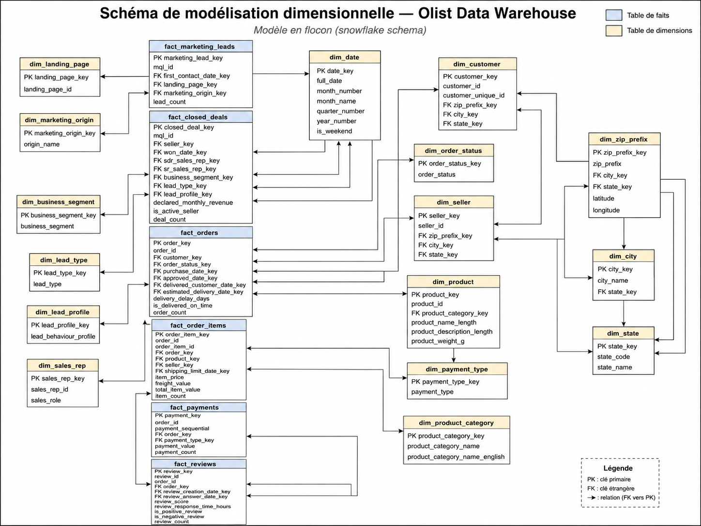
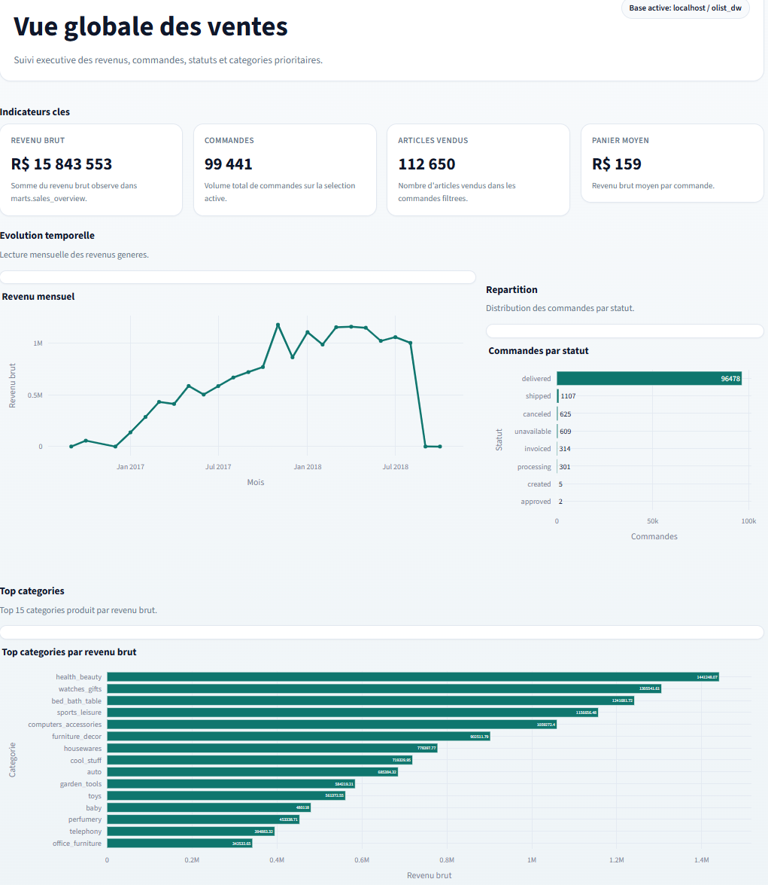
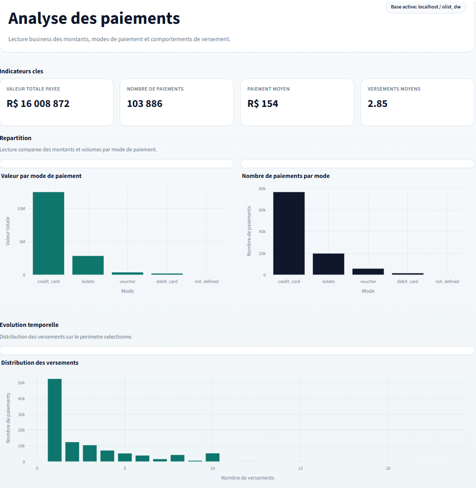
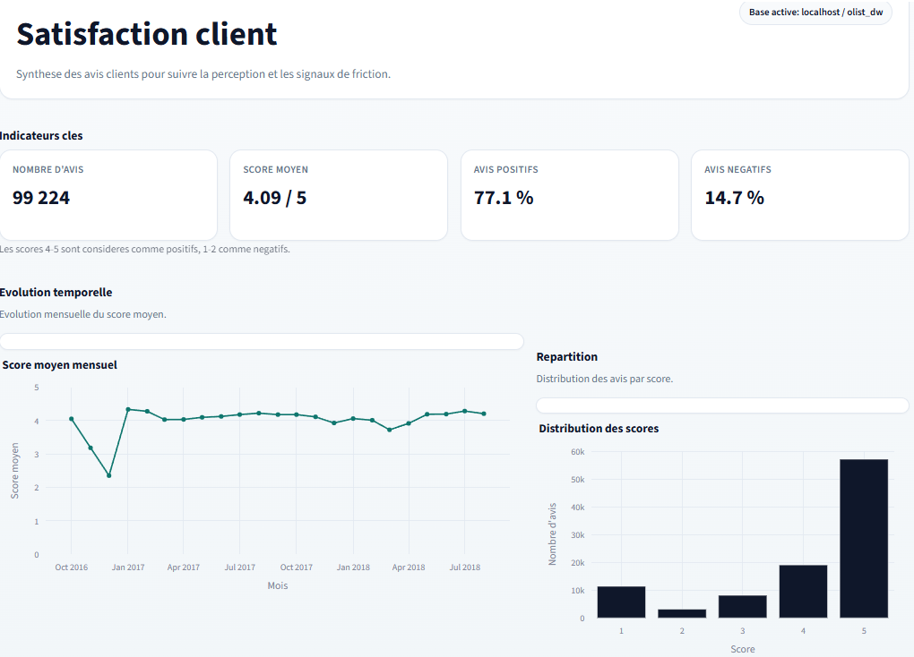
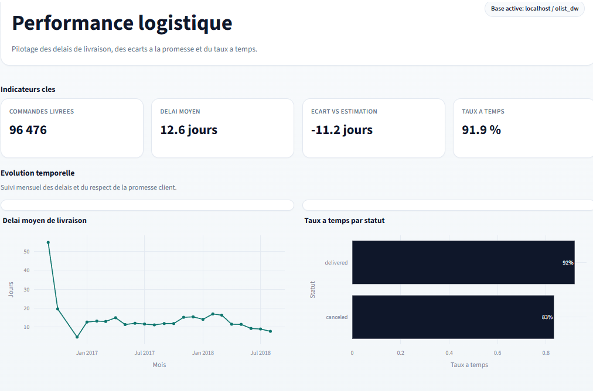
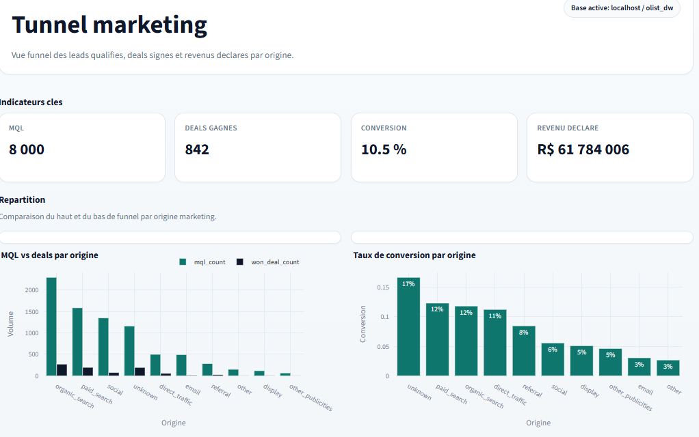
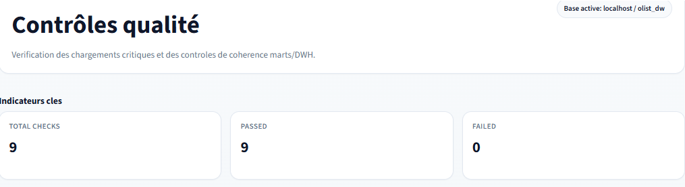

# Olist E-commerce — Data Warehouse & Business Intelligence

> Projet Data Engineering end-to-end sur le dataset public Olist Brazilian E-Commerce.  
> Construction d'un pipeline ELT complet : de l'ingestion des données brutes jusqu'à une couche analytique prête pour un dashboard interactif.

---

## Démarche du projet

Ce projet suit une démarche structurée en quatre phases, qui reflète le cycle de vie réel d'un projet Data Engineering en entreprise.

```
1. Problématique        Comprendre les données, les processus métier et les questions analytiques à couvrir
        |
        v
2. Modélisation         Concevoir le modèle dimensionnel (schéma en flocon) adapté aux processus identifiés
        |
        v
3. Pipeline ETL         Construire le pipeline ELT : ingestion raw, nettoyage staging, chargement DWH, marts
        |
        v
4. Dashboard            Exposer les données via Streamlit connecté aux vues analytiques du schéma marts
```

---

## Phase 1 — Problématique

### Contexte

Olist est une marketplace brésilienne qui connecte des vendeurs indépendants à plusieurs canaux de vente en ligne. Le dataset public mis à disposition sur Kaggle couvre l'ensemble des processus opérationnels de la plateforme sur la période 2016–2018.

Le point de départ du projet est une question simple : **à partir de 11 fichiers CSV hétérogènes, comment construire une base analytique fiable, cohérente et exploitable ?**

### Processus métier couverts

L'analyse des sources révèle plusieurs processus distincts, chacun avec sa propre granularité et ses propres dimensions :

| Processus | Fichiers sources | Questions analytiques |
|---|---|---|
| Ventes et commandes | `orders`, `order_items` | CA par mois, statut, produit, vendeur |
| Paiements | `order_payments` | Répartition par mode de paiement, nombre de versements |
| Satisfaction client | `order_reviews` | Distribution des scores, taux d'avis négatifs par catégorie |
| Logistique | `orders` (timestamps) | Délai moyen, taux de livraison en retard |
| Catalogue produits | `products`, `category_translation` | Catégories les plus vendues |
| Géographie | `geolocation`, `customers`, `sellers` | Analyse par ville, État, code postal |
| Acquisition marketing | `marketing_leads`, `closed_deals` | Conversion leads vers vendeurs par canal |

### Sources de données

| Fichier | Lignes | Description |
|---|---:|---|
| `olist_orders_dataset.csv` | 99 441 | Commandes et timestamps du cycle de vie |
| `olist_order_items_dataset.csv` | 112 650 | Lignes de commande par produit et vendeur |
| `olist_order_payments_dataset.csv` | 103 886 | Paiements (multi-modes par commande) |
| `olist_order_reviews_dataset.csv` | 104 719 | Avis clients (score 1–5) |
| `olist_customers_dataset.csv` | 99 441 | Clients avec identifiant unique stable |
| `olist_products_dataset.csv` | 32 951 | Catalogue produits avec dimensions physiques |
| `olist_sellers_dataset.csv` | 3 095 | Vendeurs de la marketplace |
| `olist_geolocation_dataset.csv` | ~1 000 000 | Coordonnées GPS par code postal |
| `product_category_name_translation.csv` | 70 | Traduction des catégories PT vers EN |
| `olist_marketing_qualified_leads_dataset.csv` | 8 000 | Leads marketing top-of-funnel |
| `olist_closed_deals_dataset.csv` | 842 | Deals conclus (leads convertis en vendeurs) |

---

## Phase 2 — Modélisation dimensionnelle

### Choix du schéma en flocon

La diversité des processus métier identifiés en phase 1 impose plusieurs tables de faits indépendantes. Les dimensions géographiques étant partagées entre clients, vendeurs et géolocalisation, un **schéma en flocon (snowflake schema)** a été retenu plutôt qu'un schéma en étoile, afin d'éviter la redondance et de garantir la cohérence des références.

### Tables de faits

| Table | Grain | Indicateurs |
|---|---|---|
| `fact_orders` | 1 ligne = 1 commande | Délais d'approbation, jours jusqu'à la livraison, retard |
| `fact_order_items` | 1 ligne = 1 article commandé | Prix unitaire, frais de port, valeur totale |
| `fact_payments` | 1 ligne = 1 paiement | Montant, type, nombre de versements |
| `fact_reviews` | 1 ligne = 1 avis client | Score, temps de réponse, indicateurs de sentiment |
| `fact_marketing_leads` | 1 ligne = 1 lead | Canal d'origine, page d'entrée, date de premier contact |
| `fact_closed_deals` | 1 ligne = 1 deal conclu | Vendeur, revenu mensuel déclaré, segment métier |

### Dimensions

`dim_date` · `dim_customer` · `dim_seller` · `dim_product` · `dim_product_category` · `dim_order_status` · `dim_payment_type` · `dim_zip_prefix` · `dim_city` · `dim_state` · `dim_marketing_origin` · `dim_landing_page` · `dim_business_segment` · `dim_lead_type` · `dim_lead_profile` · `dim_sales_rep`

### Schéma de modélisation



---

## Phase 3 — Pipeline ETL

### Architecture en couches

Le pipeline est organisé en quatre couches PostgreSQL successives, chacune avec un rôle précis :

```
Sources CSV
     |
     v
  [ RAW ]       Copie brute des fichiers CSV, sans aucune transformation.
                Sert de référence et permet de rejouer les étapes suivantes.
     |
     v
[ STAGING ]     Nettoyage, typage, standardisation des valeurs texte,
                déduplication (notamment la géolocalisation).
     |
     v
  [ DWH ]       Chargement des dimensions puis des tables de faits.
                Calcul des métriques dérivées (délais, indicateurs booléens).
     |
     v
 [ MARTS ]      Vues analytiques agrégées par domaine métier,
                prêtes à être consommées par le dashboard.
```

### Structure du projet

```
olist-data-warehouse-bi/
├── .github/
│   └── workflows/
│       └── ci.yml                     # CI GitHub Actions: installation + pytest
├── .streamlit/
│   └── config.toml                    # Configuration visuelle Streamlit
├── airflow/
│   └── dags/
│       └── olist_etl_dag.py              # DAG Airflow optionnel (production)
├── dashboard/
│   ├── README.md                         # Guide d'utilisation du dashboard
│   └── app.py                            # Dashboard Streamlit connecté aux marts PostgreSQL
├── data/
│   └── raw/
│       └── README.md                     # Liste des 11 CSV Olist attendus
├── docs/
│   └── images/
│       └── modelisation_dimensionnelle_olist.png
├── sql/
│   ├── 00_create_schemas_and_tables.sql  # Création des schémas, tables et index
│   ├── 01_create_marts.sql               # Création des vues analytiques marts
│   └── 99_quality_checks.sql             # Requêtes de diagnostic
├── src/
│   ├── config.py                         # Paramètres centralisés (DATABASE_URL, chemins)
│   ├── db.py                             # Connexion SQLAlchemy et utilitaires SQL
│   ├── extract_load_raw.py               # Chargement CSV -> raw via COPY FROM STDIN
│   ├── transform_staging.py              # Transformations SQL raw -> staging
│   ├── load_dwh.py                       # Chargement staging -> dimensions + faits
│   ├── quality_checks.py                 # Contrôles qualité automatisés
│   └── run_etl.py                        # Point d'entrée CLI du pipeline
├── tests/                                # Tests de structure et validation SQL
├── .env.example
├── docker-compose.yml                    # PostgreSQL 16 conteneurisé
└── requirements.txt
```

### Stack technique

| Composant | Rôle |
|---|---|
| Python 3.11+ | Orchestration du pipeline, transformations, qualité |
| PostgreSQL 16 | Base de données relationnelle et Data Warehouse |
| SQLAlchemy 2.x | Couche d'abstraction Python vers PostgreSQL |
| psycopg2 | Chargement performant des CSV via `COPY FROM STDIN` |
| pandas | Lecture et inspection des fichiers sources |
| python-dotenv | Configuration par variables d'environnement |
| Docker Compose | Conteneurisation de PostgreSQL |
| Apache Airflow | Orchestration du pipeline en production (optionnel) |
| Streamlit | Interface BI interactive connectée aux vues marts |
| Plotly | Visualisations interactives du dashboard |
| Pytest | Validation de structure, routing SQL et vues marts |
| GitHub Actions | Exécution continue des tests sur push et pull request |

### Installation et exécution

**Pré-requis** : Python 3.11+, Docker, fichiers CSV dans `data/raw/`

```bash
# Cloner le dépôt
git clone https://github.com/<username>/olist-data-warehouse-bi.git
cd olist-data-warehouse-bi

# Environnement Python
python -m venv .venv && source .venv/bin/activate
pip install -r requirements.txt

# Configuration
cp .env.example .env

# Démarrer PostgreSQL
docker compose up -d

# Exécuter le pipeline complet
python -m src.run_etl --step all

# Lancer le dashboard
streamlit run dashboard/app.py
```

Chaque étape peut également être exécutée individuellement :

```bash
python -m src.run_etl --step schema     # Création des schémas et tables
python -m src.run_etl --step raw        # Chargement des CSV vers raw
python -m src.run_etl --step staging    # Transformation vers staging
python -m src.run_etl --step dwh        # Chargement vers le Data Warehouse
python -m src.run_etl --step marts      # Création des vues analytiques
python -m src.run_etl --step quality    # Contrôles qualité
```

### Résultats du pipeline

**Volume chargé**

| Table | Lignes |
|---|---:|
| `fact_orders` | 99 441 |
| `fact_order_items` | 112 650 |
| `fact_payments` | 103 886 |
| `fact_reviews` | 99 224 |
| `fact_marketing_leads` | 8 000 |
| `fact_closed_deals` | 842 |

**Indicateurs clés**

| Indicateur | Valeur |
|---|---:|
| Valeur totale des articles | 13 591 643,70 R$ |
| Frais de livraison | 2 251 909,54 R$ |
| Revenu brut total | 15 843 553,24 R$ |

**Répartition des paiements**

| Type | Valeur totale |
|---|---:|
| Carte de crédit | 12 542 084,19 R$ |
| Boleto bancário | 2 869 361,27 R$ |
| Voucher | 379 436,87 R$ |
| Carte de débit | 217 989,79 R$ |

**Distribution des avis clients**

| Score | Nombre d'avis | Part |
|---:|---:|---:|
| 5 | 57 328 | 57,8 % |
| 4 | 19 142 | 19,3 % |
| 3 | 8 179 | 8,2 % |
| 2 | 3 151 | 3,2 % |
| 1 | 11 424 | 11,5 % |

### Contrôles qualité

Les contrôles qualité automatisés vérifient le chargement des couches raw, DWH et marts ainsi que la cohérence des clés critiques. La page Contrôles qualité du dashboard affiche le nombre actuel de contrôles et leur statut PASS/FAIL.

| Contrôle | Résultat |
|---|:---:|
| Données commandes chargées dans `raw` | PASS |
| `fact_orders` non vide | PASS |
| `fact_order_items` — aucun `order_key` manquant | PASS |
| `fact_order_items` — aucun `product_key` manquant | PASS |
| `fact_order_items` — aucun `seller_key` manquant | PASS |
| `fact_payments` — aucun `order_key` manquant | PASS |
| `fact_reviews` — aucun `order_key` manquant | PASS |
| Scores d'avis compris entre 1 et 5 | PASS |

---

## Phase 4 — Dashboard Streamlit

Le dashboard Streamlit est implémenté et connecté directement aux vues analytiques PostgreSQL du schéma `marts`. Il consomme les vues créées par `sql/01_create_marts.sql` sans dupliquer la logique métier du pipeline ETL, ce qui garantit une séparation claire entre préparation des données et exposition BI.

### Pages du dashboard

| Page | Vues marts utilisées | Contenu |
|---|---|---|
| Vue globale des ventes | `marts.sales_overview`, `marts.sales_by_category` | Revenu mensuel, volumes de commandes, statuts et catégories les plus contributrices |
| Analyse des paiements | `marts.payment_analysis` | Répartition par mode de paiement, valeur totale et distribution des versements |
| Satisfaction client | `marts.customer_satisfaction` | Score moyen, distribution des avis et parts d'avis positifs / négatifs |
| Performance logistique | `marts.delivery_performance` | Délai moyen, écart avec la date estimée et taux de livraison à temps |
| Tunnel marketing | `marts.marketing_funnel` | MQL, deals gagnés, revenu déclaré et conversion par canal |
| Contrôles qualité | tables `raw`, `dwh`, `marts` | Vérifications rapides de cohérence et disponibilité des données |

Le dashboard affiche également la cible PostgreSQL active (hôte / base) sans exposer le mot de passe, et gère les jeux de données vides avec des messages explicites lorsque les vues marts n'ont pas encore été chargées.

### Aperçu du dashboard

Les captures ci-dessous illustrent les principales pages du dashboard Streamlit connecté aux vues analytiques du schéma marts.

#### 1. Vue globale des ventes



#### 2. Analyse des paiements



#### 3. Satisfaction client



#### 4. Performance logistique



#### 5. Tunnel marketing



#### 6. Contrôles qualité



---

## Etat d'avancement

| Phase | Etape | Statut |
|---|---|:---:|
| Problématique | Analyse des sources et documentation | Termine |
| Modélisation | Schéma dimensionnel en flocon | Termine |
| ETL | Création des schémas PostgreSQL | Termine |
| ETL | Chargement couche raw | Termine |
| ETL | Transformation couche staging | Termine |
| ETL | Chargement Data Warehouse | Termine |
| ETL | Création des marts analytiques | Termine |
| ETL | Contrôles qualité | Termine |
| Dashboard | Développement Streamlit | Terminé |
| CI | Tests de structure et validation SQL | Terminé |

---

## Auteur

**YOUSSEF KHALOUFI**  
Data Engineering Student

[LinkedIn](https://linkedin.com/in/khaloufi-youssef) · [GitHub](https://github.com/KYoussefAI/olist-data-warehouse-bi)

---

## Licence

Ce projet est open-source sous licence [MIT](LICENSE).

Les datasets utilisés sont disponibles publiquement sur Kaggle sous licence CC BY-NC-SA 4.0 :

- [Olist Brazilian E-Commerce](https://www.kaggle.com/datasets/olistbr/brazilian-ecommerce)
- [Olist Marketing Funnel](https://www.kaggle.com/datasets/olistbr/marketing-funnel-olist)
